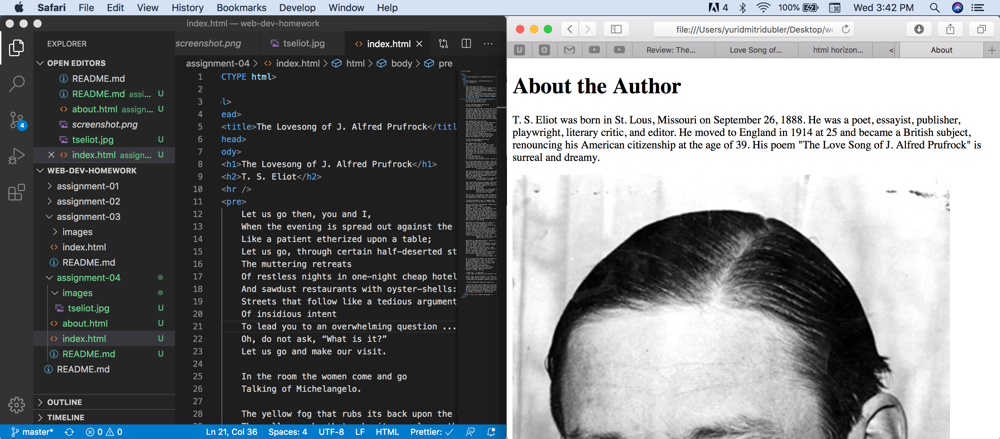

# Assignment 04

## Yuri Dubler

I used WaybackMachine to go to earlier versions of google.com. I noticed that the googles front search page changed over time. In the beginning it was a simple search bar. Then, they added some links to different types of searches above the search bar, like images, etc. Then they changed the way those links are displayed and then ultimately removed them. Then they removed those and fattened the search bar and changed the logo. It's definitely interesting to see how Google changed the front of their website.

My experience with the GIT module was good. I already know quite a bit about git being a CS major. The GIT desktop application definitely makes it easier to view, commit, and push changes to the git repository. For me, the GIT module was easy, but this is because I'm already familiar.

