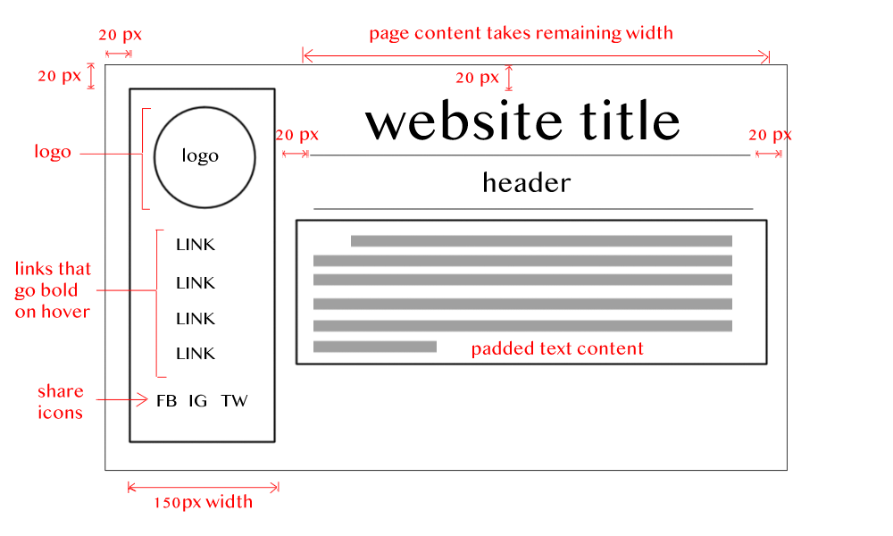

# Assignment 11

## Yuri Dubler

Padding, borders, and margins are the three types of "spaces" surrounding the contents of an element. PADDING is the inner-most cushion and is defined as "the amount of space between the inner content of the element and the element itself". A BORDER exists between the padding and margin and borders have numerous properties, such as width, color, and many others. A MARGIN is the space between elements and edges.

This assignment was quite a bit more demanding than previous assignments because we had to make the website match our site sketch using the infamous HTML positioning system. First, I attempted a different sketch which proved too demanding for the time constraints, so, I adopted one similar to the one presented in the walkthrough and the site came came out nicely. I have found new appreciation for margin and padding and I will use those more in the future for spacing purposes.
